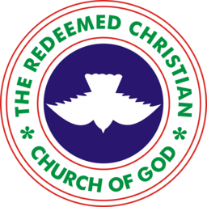

# RCCG Region 32 - Celebration House

> Official landing page for RCCG Region 32 Headquarters, Abeokuta, Ogun State



## 🎯 Project Overview

This is a modern, responsive landing page for **RCCG Region 32 (Celebration House)** built with React, TypeScript, and Tailwind CSS. The site showcases the church's mission of "Raising Champions, Dominating Territories" and provides essential information about services, ministries, events, and giving.

### Key Features

- **Hero Section**: High-impact landing with church branding and mission statement
- **Welcome Section**: Personal message from Pastor A.M. Aduradola (PICR)
- **Service Times & Location**: Interactive service schedule with embedded Google Maps
- **Ministries**: Overview of RMF, Good Women, Youth (RIYF), and Children's ministries
- **Events**: Upcoming church events and programs
- **Resources**: Sermon archives and weekly bulletins
- **Giving**: Secure bank transfer details for tithes and offerings
- **Responsive Design**: Optimized for desktop, tablet, and mobile devices

## 🛠️ Tech Stack

- **Frontend**: React 18 + TypeScript
- **Styling**: Tailwind CSS with custom RCCG brand colors
- **Animations**: Framer Motion
- **Icons**: Lucide React
- **Build Tool**: Vite
- **Fonts**: Montserrat (headings), Lora (body text)

## 🚀 Getting Started

### Prerequisites

- Node.js (v16 or higher)
- npm or yarn

### Installation

1. Clone the repository:
```bash
git clone https://github.com/Adeolu05/Celebration-House.git
cd Celebration-House
```

2. Install dependencies:
```bash
npm install
```

3. Start the development server:
```bash
npm run dev
```

4. Open your browser and visit `http://localhost:3000`

### Build & Verification

```bash
# Build for production (includes type checking)
npm run build

# Format code with Prettier
npm run format
```

The optimized production build will be generated in the `dist` folder.

## 📁 Project Structure

```
Region32/
├── public/                  # Static assets (logos, images, favicon)
├── src/                    # Main source code
│   ├── components/         # React components
│   │   ├── layout/         # Structure elements (Navbar, Footer)
│   │   └── sections/       # Individual page segments (Hero, Welcome, etc.)
│   ├── constants/          # Site content & church configuration
│   ├── assets/             # Local images & icons
│   ├── types/              # TypeScript interfaces
│   ├── App.tsx             # Root component & layout
│   └── index.tsx           # Application entry point
├── .editorconfig           # Consistent editor settings
├── .prettierrc             # Automated code formatting
├── .env.example            # Environment variables documentation
├── LICENSE                 # project licensing
├── CONTRIBUTING.md         # Contribution guidelines
├── package.json            # Scripts & dependencies
└── tsconfig.json           # TypeScript configuration
```

## 🎨 Brand Colors

- **RCCG Blue**: `#1a237e` - Primary brand color
- **RCCG Gold**: `#ffd700` - Accent color for highlights
- **RCCG Red**: `#d32f2f` - Secondary accent
- **RCCG Cream**: `#f5f5f5` - Background warmth

## 🌐 Deployment

This site is ready to deploy to **Vercel**, **Netlify**, or **GitHub Pages**.

### Quick Deploy to Vercel

[](https://vercel.com/new/clone?repository-url=https://github.com/Adeolu05/Celebration-House)

## 📞 Contact & Support

**RCCG Region 32 - Celebration House**
- **Location**: Adigbe, Abeokuta, Ogun State, Nigeria
- **Pastor**: Pastor A.M. Aduradola (PICR)
- **Social Media**:
  - Facebook: [@rccgregion32](https://www.facebook.com/rccgregion32/)
  - Instagram: [@rccgregion32](https://www.instagram.com/rccgregion32/)
  - X (Twitter): [@rccgregion32hq](https://x.com/rccgregion32hq)

## 📝 License

This project is licensed under the MIT License - see the [LICENSE](LICENSE) file for details.

---

**Built with ❤️ for the Family of Celebration**
